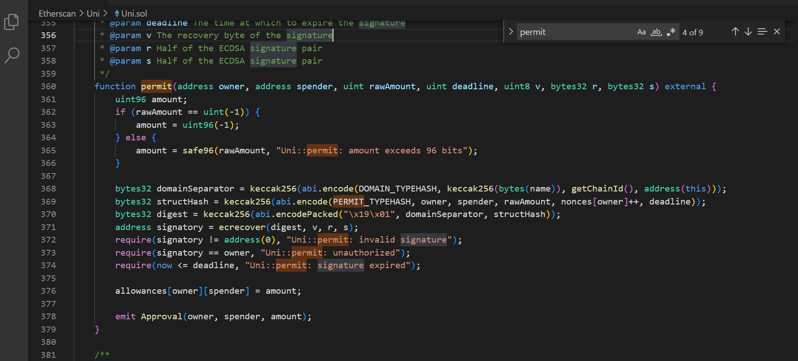

# Introduction

- **Protocol Name**: Uniswap
- **Category**: DeFi
- **Smart Contract**: Uni.sol

## Function Analysis

## Code

- **Used encoding function**: abi.encode
- **Function Name**: permit
- **Block explorer link**: [Etherscan - Uni.sol](https://etherscan.io/token/0x1f9840a85d5af5bf1d1762f925bdaddc4201f984#code)

## Purpose

The `permit` function in the Uniswap Governance contract allows an owner to approve a spender to spend tokens on their behalf using an off-chain signature. This method is used instead of an on-chain transaction, enabling gasless approvals.

## Detailed Usage

Within the `permit` function, the `abi.encode` function is used twice to construct the `domainSeparator` and `structHash`, which are then used to create a digest for signature verification.

- **domainSeparator**: The `abi.encode` function encodes the domain-specific data using `DOMAIN_TYPEHASH`, the keccak256 hash of the contract's name, the chain ID, and the contract's address. This ensures that the signature is specific to the domain and contract, preventing replay attacks across different contracts or chains.

- **structHash**: The `abi.encode` function encodes the permit-specific data using `PERMIT_TYPEHASH`, the owner's address, the spender's address, the raw amount, the owner's nonce, and the deadline. This data is used to validate the spender's permission to spend tokens on behalf of the owner.

This approach facilitates gasless approvals by allowing users to sign messages off-chain and submit them for verification on-chain, enhancing the usability of the Uniswap protocol.

